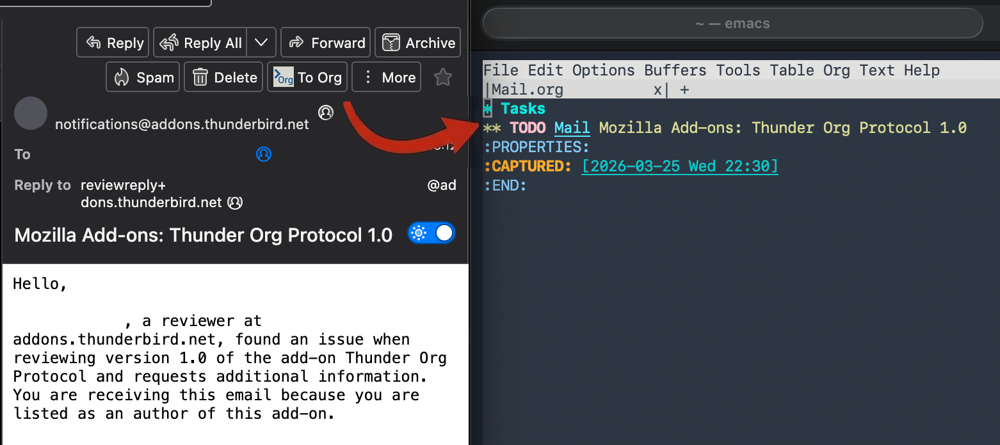
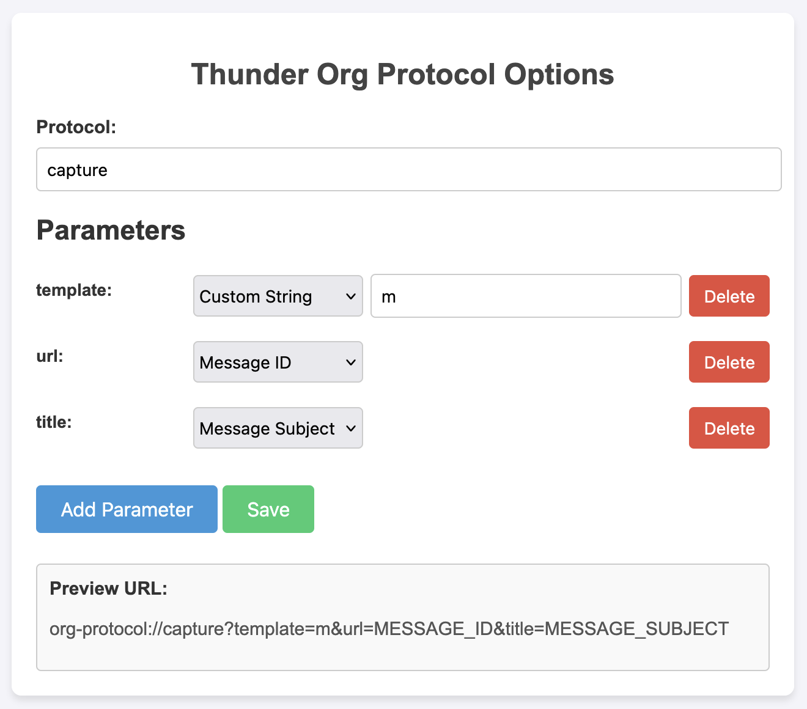

# Thunder Org Protocol

A Thunderbird extension to open org-protocol URLs.



## Instructions

Set up org-protocol:

https://orgmode.org/worg/org-contrib/org-protocol.html

Add following lines to your `.emacs` file:
```lisp
(setq org-capture-templates
      '(("m" "mail" entry (file+headline "/path/to/orgmode/Mail.org" "Tasks")
       "* TODO [[message:<%:link>][Mail]] %:description %i %?
:PROPERTIES:
:CAPTURED: %U
:END:
"
       :immediate-finish t)

))
```

Set up the options as follows:



Now whe you click on the "To Org" button


it will trigger following URL:
```
org-protocol://capture?template=m&url=MESSAGE_ID&title=MESSAGE_SUBJECT
```

and create following task in `/path/to/orgmode/Mail.org`:

```
** TODO [[message:<MESSAGE_ID>][Mail]] MESSAGE_SUBJECT
:PROPERTIES:
:CAPTURED: [2026-03-23 Mon 20:00]
:END:

```